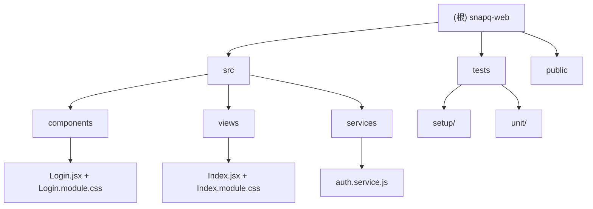

# CatGallery Web 项目文档

## 项目愿景

CatGallery Web 是一个基于 React 19 + Vite 构建的现代化 Web 应用，集成了 Ant Design UI 组件库和 React Router，提供用户登录/认证功能的企业级前端解决方案。

## 快速开始

### 开发环境启动
```bash
npm run dev
```

### 生产构建
```bash
npm run build
```

### 预览构建结果
```bash
npm run preview
```

### 运行测试
```bash
npm test
```

## 架构总览

本项目采用 React 19 函数式组件 + Hooks 模式，使用 Vite 7 作为构建工具，Ant Design 6 作为 UI 框架，React Router 7 处理客户端路由。

### 技术栈
- **前端框架**: React 19 + 函数式组件 + Hooks
- **构建工具**: Vite 7.x 提供极速的开发体验
- **UI 框架**: Ant Design 6.x 企业级组件库（中文 locale）
- **路由方案**: React Router DOM 7.x（BrowserRouter）
- **开发语言**: JavaScript (ES module / JSX)
- **样式方案**: CSS Modules（`.module.css` 文件）
- **测试框架**: Vitest + React Testing Library + jsdom

### 目录结构
```
snapq-web/
├── src/
│   ├── components/       # React 组件目录
│   │   ├── Login.jsx     # 登录组件（含 SVG 动画插画、眼球追踪）
│   │   └── Login.module.css
│   ├── views/            # 页面视图目录
│   │   ├── Index.jsx     # 首页（登录后欢迎页）
│   │   └── Index.module.css
│   ├── services/         # 服务层
│   │   └── auth.service.js  # 认证服务（token 管理、API 请求、mock 登录）
│   ├── App.jsx           # 根组件（路由配置、ProtectedRoute/GuestRoute）
│   ├── App.module.css
│   ├── main.jsx          # 应用入口（Ant Design ConfigProvider + Router）
│   └── style.css         # 全局样式
├── tests/
│   ├── setup/
│   │   ├── react.setup.js  # Vitest + React Testing Library setup
│   │   └── jest.setup.js   # 旧 Vue 测试 setup（待清理）
│   └── unit/
│       └── Login.spec.js   # 旧 Vue Login 测试（待重写为 React）
├── public/               # 公共资源
├── dist/                 # 构建输出目录
├── vite.config.js        # Vite + Vitest 配置
└── package.json          # 依赖配置
```

### 核心组件关系
- `main.jsx` → 创建 React 应用，注册 Ant Design (zhCN locale) + BrowserRouter
- `App.jsx` → 路由配置：`/login` (GuestRoute) → Login，`/` (ProtectedRoute) → Index
- `Login.jsx` → 登录表单组件，含 SVG 怪物插画（眼球追踪动画）+ Google 登录按钮
- `Index.jsx` → 登录后首页，展示用户信息 + 退出登录
- `auth.service.js` → 认证服务层，管理 token 存储（支持 rememberMe）+ API 请求封装

### 路由结构
| 路径 | 组件 | 路由守卫 | 说明 |
|------|------|---------|------|
| `/login` | Login | GuestRoute（已登录重定向到 `/`） | 登录页 |
| `/` | Index | ProtectedRoute（未登录重定向到 `/login`） | 首页 |
| `*` | - | - | 重定向到 `/` |

## 模块结构图



## 模块索引

| 模块路径 | 语言 | 职责描述 | 入口文件 | 测试覆盖 |
|---------|------|---------|---------|---------|
| `src/` | JavaScript/JSX | 核心源代码目录 | `main.jsx` | 部分（旧测试待迁移） |
| `src/components/` | React | UI 组件（Login 登录表单） | `Login.jsx` | 待重写 |
| `src/views/` | React | 页面视图（Index 首页） | `Index.jsx` | 无 |
| `src/services/` | JavaScript | 服务层（认证、API 封装） | `auth.service.js` | 无 |

## 依赖架构

### 核心依赖
- `react@^19.2.4` / `react-dom@^19.2.4`: React 19 核心库
- `react-router-dom@^7.13.2`: 客户端路由
- `antd@^6.3.4`: Ant Design 6 企业级 UI 组件库
- `@ant-design/icons@^6.1.1`: Ant Design 图标库

### 开发依赖
- `vite@^7.3.1`: 下一代前端构建工具
- `@vitejs/plugin-react@^4.7.0`: React 的 Vite 插件
- `vitest@^4.1.1`: 单元测试框架
- `@testing-library/react@^16.3.2`: React 组件测试工具
- `@testing-library/jest-dom@^6.9.1`: Jest DOM 断言扩展
- `jsdom@^29.0.1`: 浏览器环境模拟

## 认证架构

### auth.service.js
- **Token 存储**: 默认 sessionStorage，开启 "Remember Me" 时使用 localStorage
- **开发模式**: 使用 mock 登录（admin/admin123, user/user123），无需后端
- **生产模式**: 调用 `/api/auth/login` 等 API 端点
- **API 封装**: `apiRequest()` 自动附加 Bearer token + 错误处理

### 登录流程
1. 用户输入 email + password → `authService.login()`
2. DEV 环境 → `mockLogin()` 验证凭据，生成 mock token
3. Token + User 存入 sessionStorage/localStorage
4. 路由跳转到 `/` → ProtectedRoute 验证 `isLoggedIn`

## 测试策略

### 当前状态
- **Vitest 配置已就绪**（vite.config.js 中配置了 jsdom + setupFiles）
- **React Testing Library setup 已配置**（`tests/setup/react.setup.js`）
- **旧 Vue 测试待清理**:
  - `tests/unit/Login.spec.js` — 仍引用 Vue Test Utils + Element Plus，需重写为 React 测试
  - `tests/setup/jest.setup.js` — 旧 Vue setup，含 ElMessage mock，需清理

### 建议补充的测试
- **Login.jsx**: 表单交互、登录成功/失败、眼球追踪动画状态
- **auth.service.js**: token 存储切换、mock 登录验证、API 请求封装
- **App.jsx**: ProtectedRoute/GuestRoute 路由守卫逻辑

## 编码规范

### React 最佳实践
- 函数式组件 + Hooks（useState, useRef, useEffect, useCallback）
- CSS Modules 避免样式污染
- 组件命名采用 PascalCase
- 内联 SVG 组件化（如 Illustration, GoogleLogo, EyeIcon）

### CSS 规范
- CSS Modules（`*.module.css`）避免全局样式污染
- 全局样式仅在 `style.css` 中定义（reset + typography）
- 使用 `:root` CSS 变量

### JavaScript 规范
- ES6+ 语法，ES module
- 解构赋值、箭头函数
- async/await 处理异步

## AI 使用指引

### 代码生成
- 使用 React 19 函数式组件 + Hooks
- 遵循 Ant Design 6 组件规范
- 样式使用 CSS Modules（`.module.css`）
- 服务层放在 `src/services/`

### 调试建议
- 使用 React DevTools 进行组件调试
- Vite HMR 确保热重载正常工作
- 认证问题优先检查 `auth.service.js` 的 token 存储逻辑

## 已知问题 / TODO

- `tests/unit/Login.spec.js` 仍为旧 Vue 版本测试，需重写为 React 测试
- `tests/setup/jest.setup.js` 为旧 Vue setup，待清理
- 登录页中 Google 登录按钮暂未接入实际 OAuth
- "Forgot password" 链接暂未实现
- 环境变量 `VITE_API_BASE_URL` 用于配置 API 地址

## 变更记录 (Changelog)

### 2026-04-02
- 更新 CLAUDE.md：反映 Vue → React 迁移后的项目状态
- 记录新增 services 层、views 层、路由守卫、测试框架配置

### 2026-03-30
- 完成从 Vue 3 + Element Plus 到 React 19 + Ant Design 的技术栈迁移
- 新增 auth.service.js 认证服务层
- 新增 Index.jsx 首页视图
- 新增 ProtectedRoute / GuestRoute 路由守卫
- 配置 Vitest + React Testing Library 测试环境

### 2025-03-25
- 初始化项目文档结构
- Vue 3 + Vite 基础项目搭建完成
- Element Plus UI 框架集成
